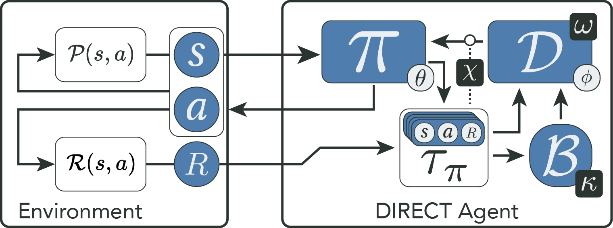

# Discriminative Reward Co-Training

[](https://doi.org/10.1007/s00521-024-10512-8)
[](https://rdcu.be/d3gj5)

This repository contains the implementation of Discriminative Reward Co-Training (DIRECT), a novel reinforcement learning extension designed to enhance policy optimization in challenging environments with sparse rewards, hard exploration tasks, and dynamic conditions. DIRECT integrates a self-imitation buffer for storing high-return trajectories and a discriminator to evaluate policy-generated actions against these stored experiences. By using the discriminator as a surrogate reward signal, DIRECT enables efficient navigation of the reward landscape, outperforming existing state-of-the-art methods in various benchmark scenarios. This implementation supports reproducibility and further exploration of DIRECT's capabilities.




## Setup

### Requirements

- python 3.10
- [hyphi_gym](https://pypi.org/project/hyphi-gym/)
- [Stable Baselines 3](https://pypi.org/project/stable-baselines3/)

### Installation

```sh
pip install -r requirements.txt
```

## Training

Example for training DIRECT:

```python
from baselines import DIRECT 

envs = ['Maze9Sparse']; epochs = 24
model = DIRECT(envs=envs, seed=42, path='results')
model.learn(total_timesteps = epochs * 2048 * 4)
model.save()
```

## Running Experiments

### Train DIRECT and baselines

```sh
python -m run DIRECT -e Maze9Sparse -t 24 --path 'results/1-eval'
python -m run [DIRECT|GASIL|SIL|A2C|PPO|VIME|PrefPPO] -e FetchReach -t 96 --path 'results/2-bench'
```

### Display help for command line arguments

```sh
python -m run -h
```

### Run Evaluation Scripts

```sh
./run/1-eval/kappa.sh
./run/1-eval/omega.sh
./run/1-eval/chi.sh
```

### Run Benchmark Scripts

```sh
./run/2-bench/maze.sh
./run/2-bench/shift.sh
./run/2-bench/fetch.sh
```

## Plotting

### Evaluation

#### Kappa

```sh
python -m plot results/1-eval/kappa -m Buffer --merge Training Momentum Scores 
```

#### Omega

```sh
python -m plot results/1-eval/omega -m Discriminator --merge Training
```

#### Chi

```sh
python -m plot results/1-eval/chi -m DIRECT --merge Training
```

### Benchmarks

#### Maze

```sh
python -m plot results/2-bench -e Maze9Sparse -m Training
```

#### HoleyGrid

```sh
python -m plot results/2-bench -e HoleyGrid -m Shift --merge Training
```

#### Fetch

```sh
python -m plot results/2-bench -e FetchReach -m Training
```
